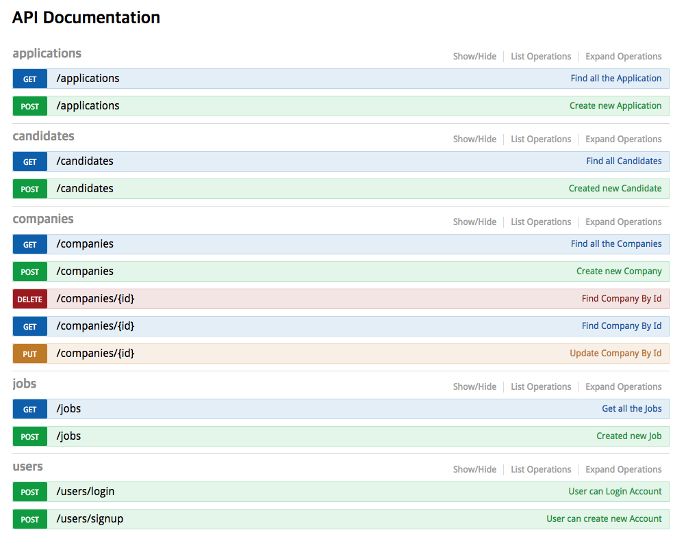

## HapiJs Tutorial

### What is the goal of this tutorial?

````sql
> implementation restful api with HapiJs
    - modularization
        module, controller, routes, model, plugins, service, config  
    - authentication in headers
        json web token
    - validation with Joi
        validate parameter value
    - mongodb
        relation Entity with mongoose
    - logging
        [stdout, file, http] with good-*
    - encryption
        encrypt password with bcrypt library
    - api documentation
        swagger
````
### pre-installed

```sql
    -- nodeJs
    -- npm insatall nodemon
        setting npm scripts in pacakage.json
```

### How to run this tutorial project ?

```sql
    -- npm install
    -- npm start
```
### Result

> > 
   